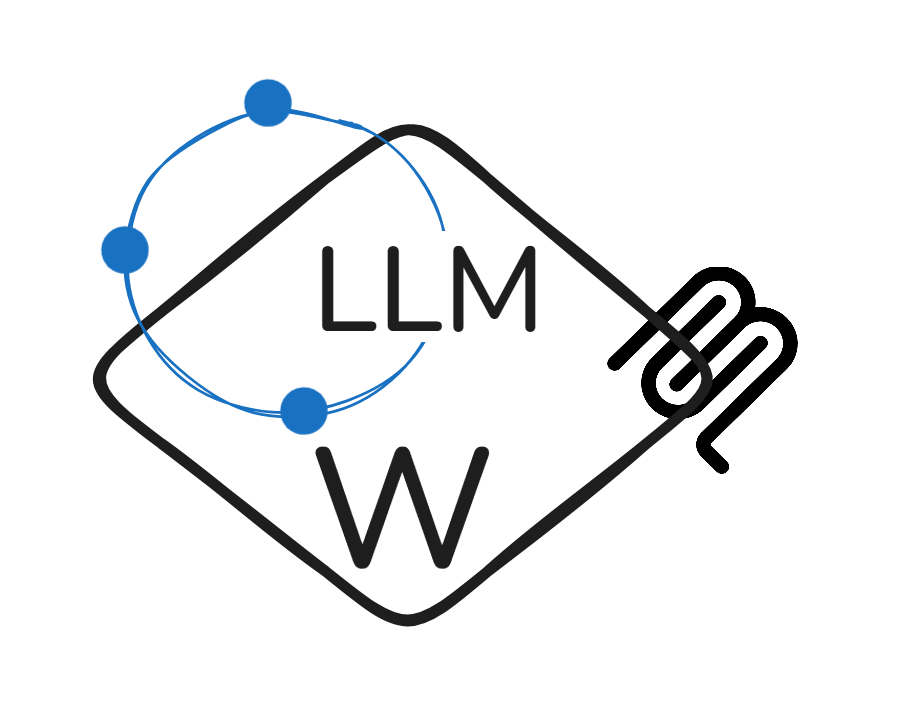

[](https://venergiac.substack.com/)

<div align="center">
  
</div>

# LLM Wiki Concept - MCP Server and Server based on Ollama

The LLM Wiki concept, popularized by Andrej Karpathy, moves away from traditional Retrieval-Augmented Generation (RAG). Instead of searching through raw documents every time you ask a question, the LLM actively compiles and maintains a structured knowledge base (a "Wiki" of markdown files).

This project implements a complete LLM Wiki pipeline with Python, Docker, and Ollama as the LLM engine, plus an **MCP (Model Context Protocol) server** for seamless integration with Claude and other AI assistants.

## Key Features

- **Automated Document Ingestion**: Drop raw documents into `data/raw/` and they're automatically processed
- **LLM-Powered Content Merging**: Uses Ollama to intelligently merge and structure content
- **Cross-Referenced Knowledge**: Automatically creates links between related wiki pages
- **MCP Server Integration**: Use Claude Desktop to query and inject content directly
- **Docker-Based Deployment**: One-command startup with Docker Compose

## Project Structure

```
llm-wiki-framework/
├── docker-compose.yml           # Orchestrates wiki processor, MCP server, and Ollama
├── Dockerfile                   # Python environment
├── requirements.txt             # Python dependencies
├── src/
│   ├── main.py                  # File watcher and processor orchestrator
│   ├── processor.py             # LLM-based content creation and merging
│   ├── mcp_server.py            # MCP server for Claude integration
│   └── utils.py                 # File I/O and markdown utilities
├── data/
│   ├── raw/                     # Drop new documents here
│   │   └── processed/           # Automatically moved after ingestion
│   └── wiki/                    # Generated wiki pages (markdown)
├── schema/
│   └── system_prompt.md         # LLM instructions for wiki architect
├── claude_desktop_config.json   # MCP server configuration
├── .dockerignore                # Docker build exclusions
├── README.md                    # This file
├── QUICKSTART.md                # Quick start guide
└── MCP_GUIDE.md                 # Detailed MCP server documentation
```

## Quick Start

For detailed setup instructions, see [QUICKSTART.md](QUICKSTART.md).

```bash
# Start all services
docker compose up --build

# Drop a document into data/raw/
echo "Your content here" > data/raw/my-docs.md

# Wiki pages are created automatically in data/wiki/
```

## MCP Server (Claude Desktop Integration)

The built-in MCP server enables Claude to:

- **Inject Content**: Add documents to the wiki programmatically
- **List Pages**: Discover what's in your knowledge base
- **Read Pages**: Retrieve full page content
- **Search**: Find information across all pages
- **Monitor**: Track wiki statistics and growth

### Enabling in Claude Desktop

1. Update your Claude Desktop configuration (see [QUICKSTART.md](QUICKSTART.md))
2. Restart Claude Desktop
3. Use the LLM Wiki tools in conversations

### MCP Tools

- `inject_raw_content` - Add content for processing
- `list_wiki_pages` - See all wiki pages
- `read_wiki_page` - Get page content
- `search_wiki` - Search across pages
- `get_wiki_stats` - View wiki statistics

See [MCP_GUIDE.md](MCP_GUIDE.md) for complete tool documentation.

## Configuration

### Environment Variables

- `OLLAMA_MODEL`: LLM model to use (default: `qwen3`)
- `OLLAMA_HOST`: Ollama server address (default: `http://ollama:11434`)
- `WIKI_RAW_DIR`: Input directory for raw documents
- `WIKI_OUTPUT_DIR`: Output directory for wiki pages
- `SYSTEM_PROMPT_PATH`: Path to system prompt configuration

### Docker Services

The `docker-compose.yml` defines three services:

1. **llm-wiki**: Main processor service (watches and ingests documents)
2. **mcp-server**: MCP server for Claude integration
3. **ollama**: LLM engine

## Workflow

```
Raw Documents → llm-wiki Processor → Ollama (LLM) → Wiki Pages
                                                        ↓
                                                   Updated via
                                                   MCP Server
```

1. Drop documents in `data/raw/`
2. The processor detects them (12-second interval by default)
3. Ollama processes content using system prompt
4. Structured wiki pages appear in `data/wiki/`
5. MCP server allows Claude to query or inject content

## Components

### src/main.py
- Watches `data/raw/` for new files
- Coordinates document processing
- Refreshes cross-references
- Moves processed files to `data/raw/processed/`

### src/processor.py
- Uses Ollama to generate wiki content
- Merges new information with existing pages
- Creates automatic cross-references
- Intelligently structures markdown

### src/mcp_server.py
- Exposes MCP tools to Claude
- Manages file I/O with the wiki
- Provides search and query capabilities

### src/utils.py
- File operations (read/write markdown)
- Wiki entity scanning
- Filename normalization
- Directory management

## Advanced Usage

### Process One File Only
```bash
docker compose run llm-wiki python src/main.py --once
```

### Custom Polling Interval
```bash
docker compose run llm-wiki python src/main.py --watch --interval 5
```

### View Logs
```bash
# Wiki processor
docker compose logs llm-wiki -f

# MCP server
docker compose logs mcp-server -f

# Ollama
docker compose logs ollama -f
```

## Troubleshooting

### Ollama Connection Issues
- Ensure Ollama is running: `docker compose logs ollama`
- Verify model is pulled: `ollama pull llama2`
- Check docker network: `docker network ls`

### Files Not Processing
- Check permissions: `chmod -R 777 data/raw/`
- View logs: `docker compose logs llm-wiki`
- Verify markdown/txt files are in `data/raw/`

### MCP Server Not Connecting
- Restart Claude Desktop after updating config
- Check paths in `claude_desktop_config.json`
- View MCP logs: `docker compose logs mcp-server`

## Documentation

- [QUICKSTART.md](QUICKSTART.md) - Setup and basic usage
- [MCP_GUIDE.md](MCP_GUIDE.md) - Complete MCP tool reference
- [schema/system_prompt.md](schema/system_prompt.md) - LLM behavior instructions

## Example Workflow

```bash
# 1. Start the system
docker compose up --build

# 2. Add a document
cat > data/raw/python-guide.md << 'EOF'
# Python Programming Guide
Python is a versatile programming language...
EOF

# 3. Monitor processing
docker compose logs llm-wiki -f

# 4. Check the generated wiki page
cat data/wiki/python-guide.md

# 5. Use in Claude Desktop
# Talk to Claude: "What's in the Python page?"
# Claude uses the read_wiki_page tool to get content
```

## License

This project is licensed under the Apache License, Version 2.0.
See the [LICENSE](LICENSE) file for details.

